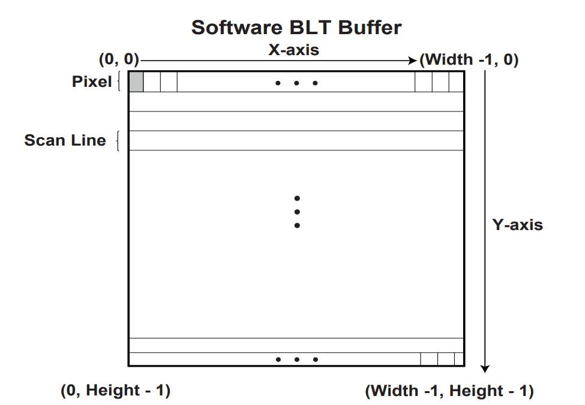

# FrameBuffer

> 帧缓冲区将视频显示抽象为像素数组

简单来说，是一个在内存中的缓冲区，修改它可以改变屏幕上的显示内容.

> a simple array mapped in memory that represents the screen.  --osdev

它位于`gGraphicsOutputProtocol->Mode->FrameBufferBase`
大小为`gGraphicsOutputProtocol->Mode->FrameBufferSize`

$ FrameBufferSize = PixelsPerScanLine \times VerticalResolution \times PixelElementSize $

当`gGraphicsOutputProtocol->Mode->Info->PixelFormat` 为 `PixelBlueGreenRedReserved8BitPerColor`时,每个像素使用 **BGRR** (Blue,Green,Red,Reserved)的格式.

此时,FrameBuffer 可以被 `BltBuffer` 直接描述.

FrameBuffer 的第一个像素元素是屏幕左上角的第一个像素.

```
+----+----------------+
+BGRR+                |
+----+                |
|                     |
|                     |
|                     |
|                     |
+---------------------+
```

# Overview

> Blt stands for BLock Transfer.

`EFI_GRAPHICS_OUTPUT_PROTOCOL`中的基本图形操作是Blt

## BltBuffer



`X-axis` 表示扫描线(Scan Line).扫描线是 **显示器上像素的水平线**.

BltBuffer 的结构为 `EFI_GRAPHICS_OUTPUT_BLT_PIXEL` 数组.

```c++
typedef struct {
  UINT8 Blue;
  UINT8 Green;
  UINT8 Red;
  UINT8 Reserved;
} EFI_GRAPHICS_OUTPUT_BLT_PIXEL;
```

要访问一个 BltBuffer 数组的一个像素,可以指定下标或使用指针.

## Blt

Uefi为我们提供了接口对显示器进行操作.

- `EFI_GRAPHICS_OUTPUT_PROTOCOL.Blt`

```c++
typedef
EFI_STATUS
(EFIAPI *EFI_GRAPHICS_OUTPUT_PROTOCOL_BLT)(
  IN  EFI_GRAPHICS_OUTPUT_PROTOCOL            *This,
  IN  EFI_GRAPHICS_OUTPUT_BLT_PIXEL           *BltBuffer,   OPTIONAL
  IN  EFI_GRAPHICS_OUTPUT_BLT_OPERATION       BltOperation,
  IN  UINTN                                   SourceX,
  IN  UINTN                                   SourceY,
  IN  UINTN                                   DestinationX,
  IN  UINTN                                   DestinationY,
  IN  UINTN                                   Width,                     // BltBuffer的宽度
  IN  UINTN                                   Height,                    // BltBuffer的高度
  IN  UINTN                                   Delta         OPTIONAL
  );
```

此枚举了 BltOperation 支持的操作.

```c++
typedef enum {
  EfiBltVideoFill,                   // 填充
  EfiBltVideoToBltBuffer,            // 从屏幕到缓冲区
  EfiBltBufferToVideo,               // 从缓冲区到屏幕
  EfiBltVideoToVideo,                // 复制
  EfiGraphicsOutputBltOperationMax   // 应该是保留,检测界限
} EFI_GRAPHICS_OUTPUT_BLT_OPERATION;
```

### 从缓冲区到屏幕

**如果`SourceX`或`SourceY`不为0,则`Delta`必须提供且为 BltBuffer 一行的字节数.**

### 从屏幕到缓冲区

**如果`DestinationX`或`DestinationY`不为0,则`Delta`必须提供且为 BltBuffer 存储一行的字节数.**

## Hard Core!

- `Main.c`
