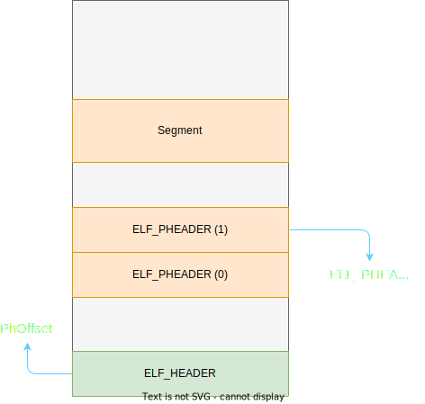

# Overview

> elf - format of Executable and Linking Format (ELF) files

```shell
man elf
```

---

- <https://wiki.osdev.org/ELF>
- <https://www.cnblogs.com/AndroidBinary/p/15364043.html>

# ElfLoad

- Section 节
- Segment 段

**链接时用节,加载时只关注段.**

Elf的加载在 操作系统之上最为常见,还有虚拟内存的Buff加持,可以 ~~随心所欲~~

## Elf 文件头 - ELF_HEADER

我们要借助 ELF_HEADER 来帮我们 检测文件格式 以及 加载.

---

对于 ia32 与 ia64 有不同的 ELF_HEADER (见 `src/include/boot/Elf.h`)

```c++
typedef struct {
    UINT32 Magic;
    UINT8  Class;
    UINT8  Data;
    UINT8  Version;
    UINT8  OSABI;
    UINT8  ABIVersion;
    UINT8  Pad[6];
    UINT8  Nident;
    UINT16 Type;
    UINT16 Machine;
    UINT32 ObjFileVersion;
    UINT64 Entry;
    UINT64 PhOffset;
    UINT64 ShOffset;
    UINT32 Flgs;
    UINT16 EhSiz;
    UINT16 PhentSiz;
    UINT16 PhNum;
    UINT16 ShentSiz;
    UINT16 ShNum;
    UINT16 ShStrIdx;
} ELF_HEADER_64;
```

---

`Magic` 即 `[0x7F,'E','L','F']` 或 `0x464C457F`,表示此为 Elf 文件.

由于位于 `Machine` 后的类型才开始变化以适配不同的机器,于是我们可以通过 `Machine` 来检测架构.

```c++
#define EM_386         3
#define EM_X86_64      62
#define EM_ARM         40
#define EM_AARCH64     183
```

---

`Type` 标定 Elf 文件的类型:

```c++
#define ET_NONE        0 // 无效
#define ET_REL         1 // 可重定位文件
#define ET_EXEC        2 // 可执行文件
#define ET_DYN         3 // 共享目标文件
```

显然,目标是 `ET_EXEC`.

---

`Entry` 即为入口点地址

## Elf 程序头 - ELF_PHEADER

只列举 x64 啦...

```c++
typedef struct {
  UINT32 Type;          // Type of the segment,e.g. PT_LOAD
  UINT32 Flgs;          // Segment flags
  UINT64 Offset;        // The segment's offset in the file
  UINT64 VirtualAddr;
  UINT64 PhysicalAddr;
  UINT64 FileSiz;       // The size of the segment in the file
  UINT64 MemSiz;        // The size of the segment that used in memory space
  UINT64 Align;
} ELF_PHEADER_64;
```

- Type
  - PT_NONE (0x0)
  - PT_LOAD (0x1) - 就是我们的对象,这个类型的段要加载
- Offset - 段在文件中的偏移
- FileSiz - 段在文件中的所占大小
- MemSiz - 段被加载到内存后所占大小
- Align - 对齐参数
  - 0 / 1 - 无需对齐
  - 2的倍数 - 

于是我们到此查表的过程如下所示:



## Copy!!!

在实际加载时,我们要做的工作无非就是 复制 ~~我们的传统艺能desu~~

Uefi 将物理内存对等隐射进虚拟内存,使得我们可以直接访问物理内存,几乎感觉不到虚拟内存的存在.
`ELF_PHEADER.VirtualAddr` 在此时实际也可以指物理地址了.此时程序也是拥有全部内存的.

## Let's start here

进入内核应该是最简单的部分了...

当前由于我们要测试一下调用是否成功,接受一下返回值,实际内核在进入之后不再返回 Boot,原因有二:
1. 内核本身不需要返回 Boot
2. 内核进入之后会切换栈,或在调用时就切换.

---

这里有几种常见的方法:

1. 强制类型转换成函数指针,并调用

```c++
((UINT64 (*)(void))KernelEntry)();
```

2. `jmp`
使用汇编指令,参数就应手动存入 (`rdi` -> `rsi` -> `rdx` -> ..)

以下将入口地址先存入 `rax`,再执行 `jmp`
```c++
__asm__ volatile ("jmpq %%rax" : : "a"(KernelEntry));
```

3. `ret`

将 入口点地址 压入栈中,然后 `ret`

```c++
__asm__ volatile ("pushq %0" : : ""(KernelEntry));
```

4. `iret`

其实是中断返回,被我们拿来玩...

在 `iret` 指令执行时,会按照此顺序依次出栈 : `SS -> RSP (original RSP) -> RFLAGS -> CS -> RIP`

于是我们可以在 Boot 阶段就完成 **Gdt 的加载**,以及 **部分段寄存器(ss, cs)的重载**

灵感来自 <https://github.com/naoki9911/edk2/tree/xv6_uefiloader>
