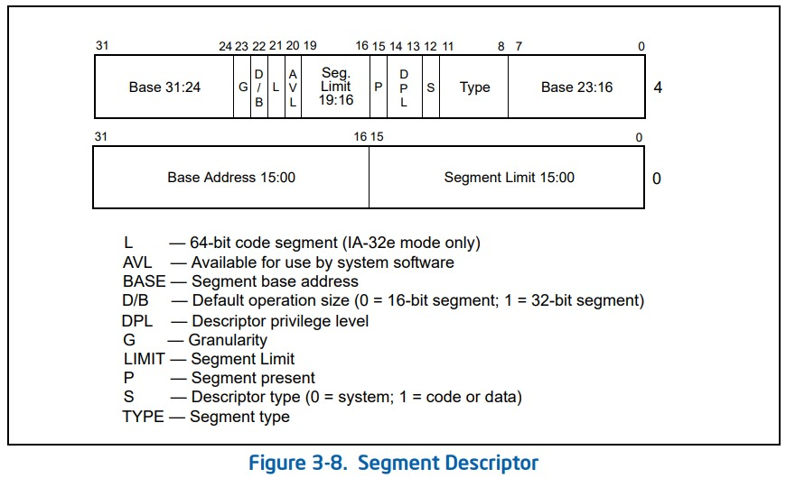
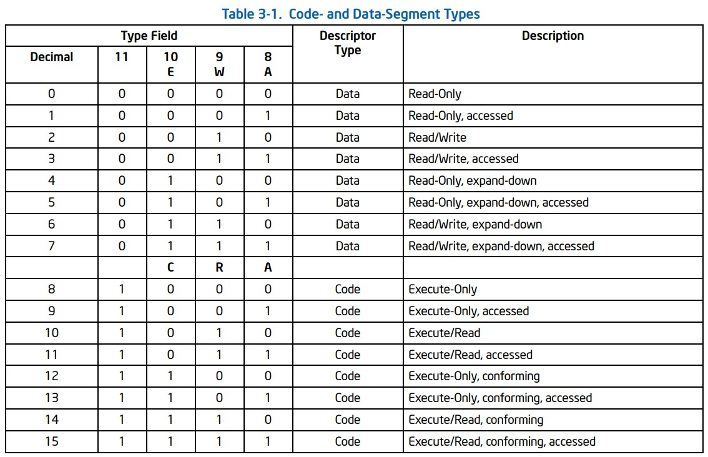
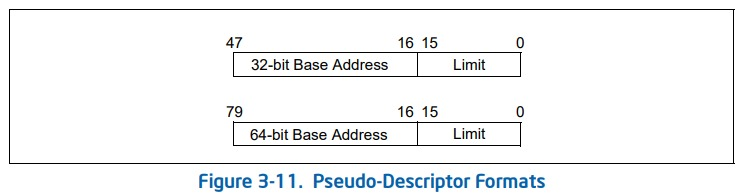

# Overview

- https://wiki.osdev.org/GDT
- https://github.com/LordNoteworthy/cpu-internals

在 64位 模式下已经不是很重要了,于是采用 **平坦模式**.

# Structure

同 32 位,gdt的每个项都是 64bit 的.

至于为什么会这么乱呢,主要是历史遗留问题 (real mode).



## AccessByte

- `A` - Accessed bit
- `RW` - Readable / Writable bit
- `DC` - Direction bit/Conforming bit
  - Data
    - 0 - 向上拓展
    - 1 - 向下拓展
  - Code
    - 0 - 只能给此 DPL 执行
    - 1 - 可以给此 DPL 及以下执行
- `EXE` -



---

- `S`
  - 0 - 系统段
  - 1 - Code / Data 段
- `DPL` - Descriptor privilege level 特权级 (0 ~ 3)
- `P` - 有效

## Flags

- `AVL` - 保留,友情赠送
- `L` - 长模式
  - 如果不是 64位模式(IA-32e) 或者不是代码段置 0
  - 0 -> `D/B` 置0
- `D/B`
  - 0 - 16-bit
  - 1 - 32-bit
- `G` Granularity 作 Limit 单位
  - 0 - 1 Byte
  - 1 - 4 KB

# Set up

```c++
typedef struct _packed
{
    u16 LimitLow  : 16;
    u32 BaseLow   : 24;
    union {
        struct {
            u8 A       : 1;
            u8 RW      : 1;
            u8 DC      : 1;
            u8 EXE     : 1;
            u8 S       : 1;
            u8 DPL     : 2;
            u8 Present : 1;
        };
        u8 Raw : 8;
    } AccessByte;
    u8  LimitHgh  : 4 ;
    u8  Flgs      : 4;
    u8  BaseHgh   : 8 ;
} Gdt_t;
```

---

> The first entry in the GDT (Entry 0) should always be null and subsequent entries should be used instead.

将 `Base` 置0,Limit 置最大值.

## lgdt



```c++
typedef struct _packed
{
    u16 Limit; // gdt占用
    u64 Base;  // gdt的地址
} Gdtr_t;
```

`lgdt` 使用一个 80bit 的操作数.
