# Docs

- [https://juejin.cn/post/7007597479449329701]

# 方式

- 隐式空闲链表

> 结构与结构之间没有直接的指针指向,而通过其他方式定位.

- 间距式
- 下标式

---

使用 8-Byte 的对齐!!!

# 结构

| 位       | 描述                      |
| -------- | ------------------------ |
| 0        | A/F 标记块是否已被分配      |
| 1 ~ 2    | 暂时保留                  |
| 3 ~ 31   | 块大小(Byte),包括头部与脚部 |

---




这样的好处在于,即使使用 8-Byte 的对齐,依然可以完美地塞下 头部与脚部,成本较低.

## 关于脚部

> Knuth 提出了一种聪明而通用的技术，叫做边界标记（boundary tag）

在合并相邻空闲块的时候,可以很方便地通过 脚部 找到 **上一个头部**,而不需要再遍历查找.

# 细节

初始化时将分配一段初始空间. -> Base

- Padding
- 序言块
- 结尾块

---

- 序言块  `Base + 4`
- 普通块 - `Base + 12`

## 分配

- Request size <  Block size
  - 裂开原有的 Block
- Request size == Block size
  - 直接标记
- Request size >  Block size
  - Continue!!!

都没有找到呢? 尤其是最开始 `MallocK` 的时候. 扩充!!!

## 释放

1. 检测
2. 标记
3. 合并

# 组织

```c++
typedef struct {
    void   *Brk;   // 指向结尾块,Break 指针
    void   *Root;  // 指向第一个块头,即序言块后的第一个头
    void   *Max;   // 虚拟内存中堆的有效最大地址
} Heap_t;
```
