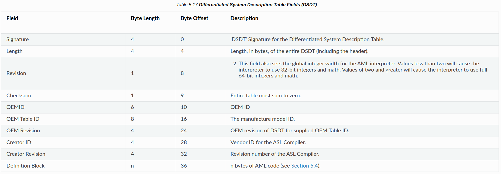

# overview

最近在弄这个 e1000 网卡, 就涉及到一个 pci 中断的问题. 主要涉及到 pci 配置如下:

---

- [pci config space header](https://wiki.osdev.org/PCI#Header_Type_0x0)
    - 0x3c - u8 - interrupt line
    - 0x3d - u8 - interrupt pin

连接到 8259 / 8259 从片控制器的引脚就是 `interrupt line`. 也就是 `irq number`.

---

> Interrupt Line: Specifies which input of the system interrupt controllers the device's interrupt pin is connected to and is implemented by any device that makes use of an interrupt pin. For the x86 architecture this register corresponds to the PIC IRQ numbers 0-15 (**and not I/O APIC IRQ numbers**) and a value of 0xFF defines no connection

这句话就 提醒再深入了解一下 pci

PCI 拥有连接到 PIC/APIC 的中断线有 4 根:

- pin = 0 - INTA#
- pin = 1 - INTB#
- pin = 2 - INTC#
- pin = 3 - INTD#

连接到 8259 / 8259 从片控制器的引脚就是 `interrupt line`, 这条 PCI 中断线 就是 pin.

```
(应该是)
                             +--------+
                            -|        |-
Dev -> INTx# -> intr line# --|  PIC   |-
                            -|        |-
                             +--------+
```

然而这在 APIC 的系统上就不适用, 这时就需要解析 ACPI

解析 ACPI 的表结构比较简单, 只需要定义与搜索就可以了, 但是 需要 ACPI 的所有功能, 就需要 解析 AML 代码

---

> AML - ACPI Machine Language

具有 opcode, 类比于 jvm, 所以可以做到 "平台无关".[^1]

[^1]: <https://wiki.osdev.org/AML>

我们需要从 `AML code` 找 `_PRT` 方法, 并执行它, AML 位于 DSDT/SSDT的最后 [^2]

[^2]: <https://uefi.org/htmlspecs/ACPI_Spec_6_4_html/05_ACPI_Software_Programming_Model/ACPI_Software_Programming_Model.html#differentiated-system-description-table-dsdt>



~~好了, 现在你已经知道如何找到 AML 了, 再给你一个 [文档](https://uefi.org/specifications), 快去写一个 AML 解析器 吧!~~

---

当然, 造这种轮子, 感觉有点费劲, 所以直接用现成的库吧[^3]

[^3]: [osdev 推荐](https://wiki.osdev.org/LAI)

- ACPICA - ACPI Component Architecture (makefile)
- LAI - Lightweight AML Interpreter (meson)
- uACPI (cmake)

---

这里选 LAI. ~~很简洁, 很戳我~~

# lai

> [Lightweight AML Interpreter](https://github.com/managarm/lai)

## init

一般这种可以移植的库都需要提供一个 "兼容层" (中间层), 提供必要的 api

需要内核提供的函数见 [wiki](https://github.com/managarm/lai/wiki/Host-API-Documentation).

TextOS 实现的函数见 `kernel/lai/layer.c`

其中, 很重要的一个:

```
/* Returns the (virtual) address of the n-th table that has the given signature,
   or NULL when no such table was found. */
void *laihost_scan(char *sig, size_t index);
```

---

在准备好了之后调用[^4]:

[^4]: 初始化参考 [fzOS](https://github.com/fzOS/fzOS-kernel)

```c++
lai_create_namespace();
lai_enable_acpi(1); // 1 表示 ioapic 模式
```

## and then?

- `lai_pci_route_pin`

---

**简化流程**!

```
        PCI INTx                IDT
PCI Dev ---...-> IOAPIC #IRQ ---...-> OS Handler
```

1. 找出 PCI INTx 线, 连接到 IOAPIC 的 IRQ
2. 向 IOAPIC RTE 表注册 中断向量

# ways!!!

- INTx#
- MSI (Message Signaled Interrupt) - e1000e

> e1000 不支持  MSI
